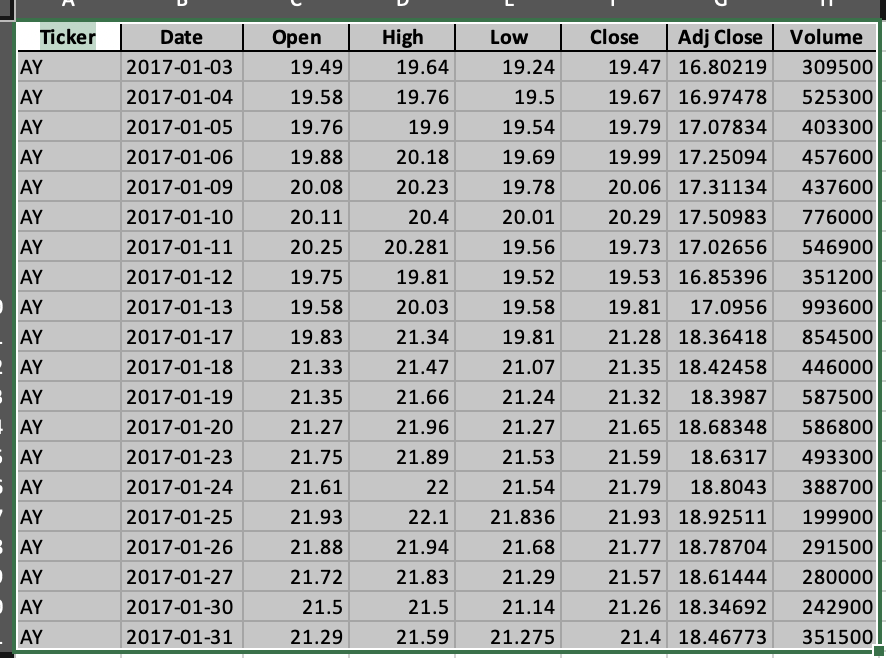
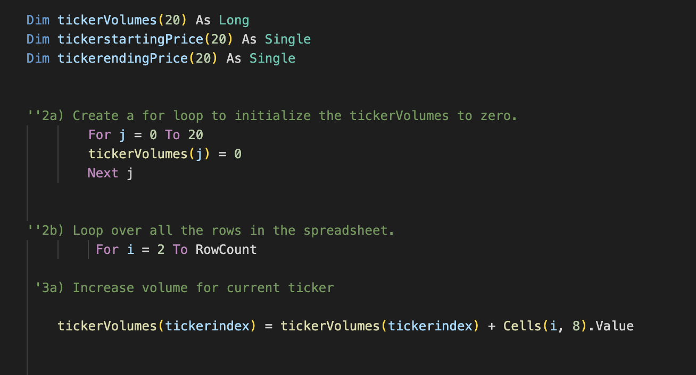
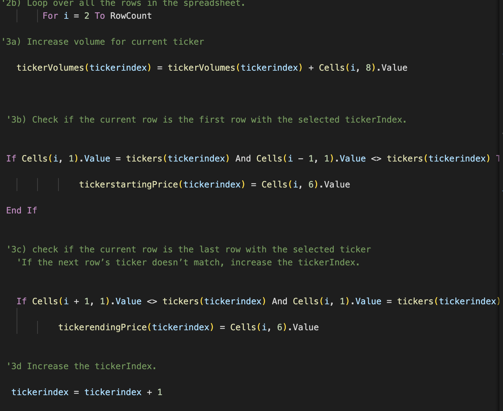
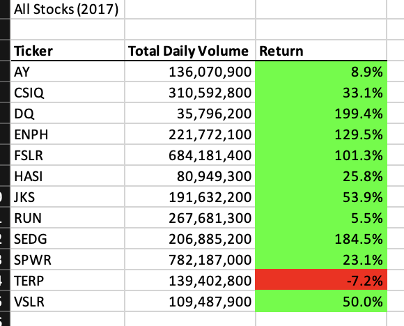
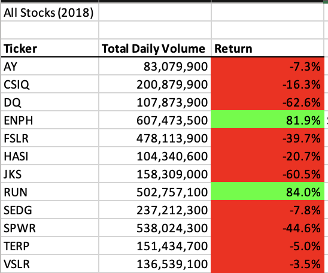
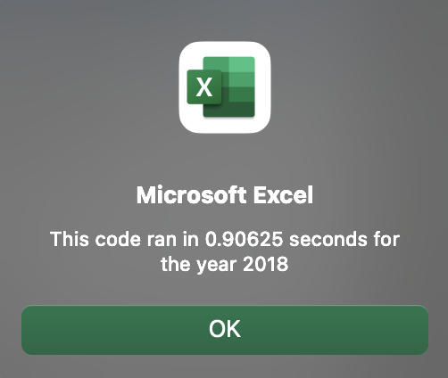
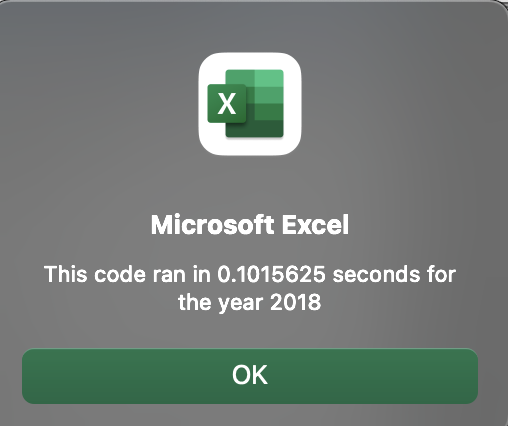
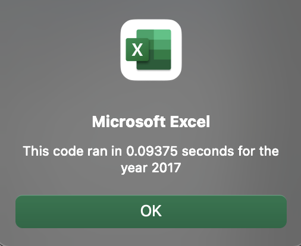

# VBA Challenge

## Overview of Project

In this project we are helping Steve who has just completed his finance degree and now helping his parents to analyze several green energy stocks. He is trying to diversify his parent's stock for more investment income. 

### Purpose
We are helping Steve to analyze several green energy stocks. He is trying to diversify his parent's stock for more investment income. By using extension to excel, built to automate tasks we will be using VBA. Using code to automate analysis will allow Steve to reuse it with any stock, and reduces the chance of accidents and errors. 

## Analysis & Results

 In this data Steve has different ticker stocks, there are about 12 stocks whose returns for year 2017 and 2018 will be looked into. Some of stocks are AY, ENPH, FSLR, HASI, JKS, RUN, VSLR, DQ. Steve has date, opne, high, low, close and most importantly total volume of the stocks. Using this columns we are going to find the returns for each stock and total volume of stocks and can easily analysis which are loss making stock and how to invest further. We are going to compare the stock performance of year 2017 and 2018 by using VBA code 
 Initially we are finding totalvolume of the stock by using following code:

 
 Then we will find the retuns of the ticker stocks for year 2017 and 2018. For year 2017, we can explore that Ticker DQ, ENPH and FSLR has more than 100% return values. Also stock SEDG has outperformed by giving around 180% return for financial Year 2017. We can also infer that only TERP stock has negative return of 7.2%. Seeing the trend of year 2017, Steve should invest in top performing stocks 

 Now after analyzing the stocks for year 2018, There was suprisingly very different trend for this year. As we can infer that the highest performing stocks in previous year are among the lowest stocks with negative returns. There are only two stocks ENPH & RUN which are giving positive returns of around 80 % respectively. Else other all Stocks are outperformed badly. 

Using VBA we also factored the exection times of the code for year 2018. Original Script took 0.90625 seconds and refractored script took 0.1015625 seconds.

Time elapsed (Original Script)

Time elapsed 2018 (Refractored)

So refactoring the scripts has not impacted the time taken to run the code. This same pattern can be seen for the year 2017.  

 ## Summary

 Overall by using refractoring VBA code we analysed returns of the stocks, and clear difference between both years are seen. One of the main advantage of refactoring is that it leads to better quality code. Also it helps finding bugs and debugging it. Refractoring VBA script makes code referesher, easier to understand. The potential disadvantage is that we might have to retest lots of functionality, and it is time consuming intially. 

 
      

